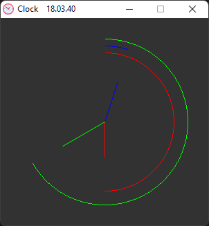

# Clock

Simple but clean clock made with `Pygame` library in `Python 3`!

---

### How to use

- To open the clock, just double-click the `clock.exe` file. You don't need to install anything, since the application is a stand-alone program.
- The clock shows the current system time

---

---

### Requirements

- Nothing is required for the Clock application to work, but for development purposes you will need:
  * `Python 3` You can download Python from [here](https://www.python.org/downloads/)
  * `Pygame` You can find download instructions for the module from [here](https://github.com/pygame/pygame)

---

# License
- This repository is licensed with MIT-license. To learn more about the MIT-license, check out [this](https://en.wikipedia.org/wiki/MIT_License) webpage.

---